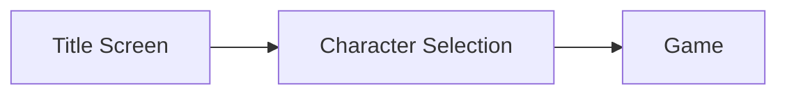

# Getting Started
## Python
### Start Service
From a console, goto the py-src/clueless directory and run the following:

    python.exe service.py
#### Example Output

    D:\a-team\py-src> python service.py
    listening from 127.0.0.1
    Accepting new connection
    invalid direction

### Run Client Tests
From another console, goto the py-src/clueless directory and run the following:

    python.exe client1.py

### Example Output
    D:\a-team\py-src>python client1.py
    connecting to localhost port 8000
    Scarlet is not active in room Invalid
    Mustard is not active in room Invalid
    White is not active in room Invalid
    Green is not active in room Invalid
    Peacock is not active in room Invalid
    Plum is not active in room Invalid
    Character secessfully claimed.
    Failed to claim character
    Game started.
    Move complete.
    Scarlet is not active in room Invalid
    Mustard is not active in room Invalid
    White is not active in room Invalid
    Green is in Hallway (N Invalid S Invalid E Ballroom W Conservatory O Invalid)
    Peacock is not active in room Invalid
    Plum is not active in room Invalid
    mode 0x60 target 0 A 0 W 0 L 0
    Move invalid.
## GML (Game Maker Studio 2)
You'll want to download Game Maker Studio 2 Trial from https://www.yoyogames.com/get

Once you've got it, just open the project and hit the triangle play button. If you click host, it'll put you into a character selection screen and then the game screen.

